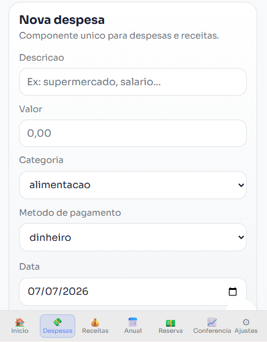
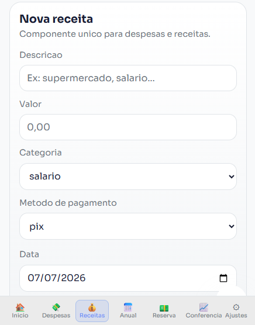
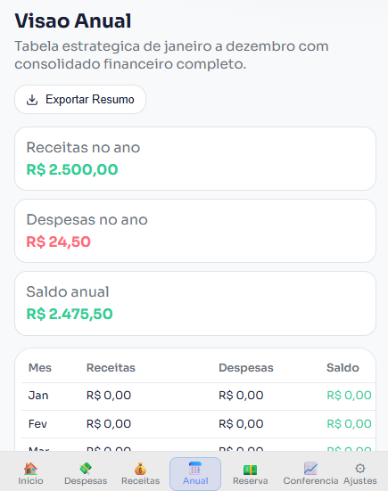
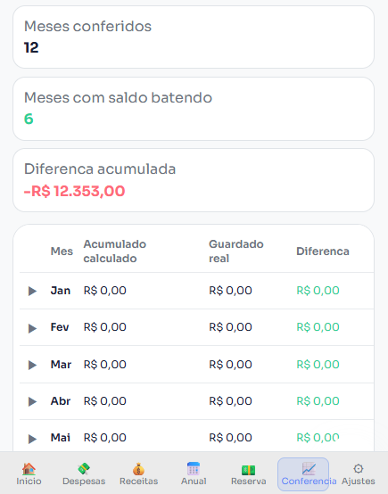

<div align="center">

# FluxoX

**Controle financeiro pessoal, construído do zero.**

[](https://reactjs.org/)
[](https://vitejs.dev/)
[](https://recharts.org/)
[](https://web.dev/progressive-web-apps/)
[](https://fluxox.vercel.app)
[](https://github.com/pedrohenriquesilva-dev/FluxoX/commits/main)

<br/>

[**Acessar o app →**](https://fluxo-x.vercel.app/)&nbsp;&nbsp;·&nbsp;&nbsp;[Ver commits](https://github.com/pedrohenriquesilva-dev/FluxoX/commits/main)&nbsp;&nbsp;·&nbsp;&nbsp;[Reportar bug](https://github.com/pedrohenriquesilva-dev/FluxoX/issues)

</div>

---

## Índice
- [O que é o FluxoX?](#o-que-é-o-fluxox)
- [Por que este projeto existe](#por-que-este-projeto-existe)
- [Screenshots](#screenshots)
- [Funcionalidades](#funcionalidades)
- [Lógica financeira](#lógica-financeira)
- [Stack](#stack)
- [Estrutura](#estrutura)
- [Rodando localmente](#rodando-localmente)
- [Autor](#autor)

---

## O que é o FluxoX?

Uma alternativa ao controle financeiro em planilha. Em vez de fórmulas que quebram e abas difíceis de navegar, o FluxoX é uma aplicação web completa que separa automaticamente gastos, calcula sua economia real e mostra se você está no caminho certo em relação à sua meta mensal.

Todos os dados ficam **100% no navegador** (`localStorage`): não há backend, não há conta de usuário, não há coleta de dados. É rodar e usar.

## Por que este projeto existe

Este projeto nasceu como projeto acadêmico com um objetivo claro: sair de um app "de tutorial" e construir algo com regra de negócio real, sem atalhos de bibliotecas prontas de UI. Os 24 componentes de interface (modal, toast, sidebar, gráficos, skeleton loading) foram implementados manualmente para consolidar fundamentos de React, CSS e arquitetura de front-end, não para reinventar a roda em produção, mas para provar domínio de cada peça antes de depender de uma lib.

---

## Screenshots

| Dashboard | Despesas | Relatórios |
|:-:|:-:|:-:|
|  |  |  |

| Estatísticas | Conferência | Premissas |
|:-:|:-:|:-:|
|  |  |  |

---

## Funcionalidades

```
✅ Despesas e receitas com CRUD completo
✅ Separação automática eletrônico vs espécie
✅ Meta mensal com barra de progresso
✅ Resumo anual em 3 blocos (eletrônico, espécie, planejamento)
✅ Relatórios por categoria e forma de pagamento
✅ Estatísticas com recordes e hábitos do ano
✅ Conferência: saldo calculado vs saldo real
✅ Exportação para CSV (despesas, receitas, resumo anual)
✅ Resumo mensal em texto para compartilhar no WhatsApp
✅ Busca global com Ctrl+K e highlight de texto
✅ Toast notifications em todas as ações
✅ Tema claro e escuro (detecta o sistema automaticamente)
✅ Skeleton loading no Dashboard
✅ Animações de entrada com IntersectionObserver
✅ PWA instalável no celular
✅ Responsivo - sidebar no desktop, nav inferior no mobile
```

---

## Lógica financeira

| Conceito | Cálculo |
|---|---|
| **Eletrônico** | Qualquer forma que não contenha "dinheiro" ou "físico" |
| **Espécie** | Forma = "Dinheiro Físico" |
| **Economia Real** | Entrada Eletrônica - Saída Eletrônica |
| **Acumulado** | Soma progressiva da economia mês a mês |
| **Conferência** | Total Guardado - Acumulado Calculado |
| **Taxa de Economia** | Economia ÷ Total Recebido × 100 |

---

## Stack

| | Tecnologia | Por quê |
|---|---|---|
| ⚛️ | React 18 | Framework principal — hooks e componentes funcionais |
| ⚡ | Vite 5 | Build ultrarrápido e HMR instantâneo |
| 📊 | Recharts 3 | Gráficos de barra, pizza e linha com tooltips interativos |
| 📦 | vite-plugin-pwa | Service worker e manifest gerados automaticamente |
| 🎨 | CSS puro | Design system com variáveis — sem Tailwind, sem libs de UI |
| 💾 | localStorage | Dados 100% locais, sem servidor, sem conta |
| 🚀 | Vercel | Deploy contínuo a cada push na main |

> **Nenhuma biblioteca de componentes foi usada.** Os 24 componentes de interface foram construídos do zero para demonstrar domínio real de React e CSS.

---

## Estrutura

```
src/
├── components/ui/      # 24 componentes (Sidebar, Charts, Modal, Toast...)
├── components/transactions/ # TransactionForm, TransactionList
├── contexts/           # ToastContext — notificações globais
├── hooks/              # 7 hooks (useFinance, useTheme, useGlobalSearch...)
├── pages/              # 9 telas (Dashboard, Despesas, Relatórios, Stats...)
└── utils/              # formatters, exportCsv, exportText, storage
```

---

## Rodando localmente

```bash
git clone https://github.com/pedrohenriquesilva-dev/FluxoX.git
cd FluxoX
npm install
npm run dev        # http://localhost:5173
```

Para testar o PWA:
```bash
npm run build
npm run preview    # http://localhost:4173
```

---

## Autor

**Pedro Henrique da Silva**
[github.com/pedrohenriquesilva-dev](https://github.com/pedrohenriquesilva-dev)

---

<div align="center">
  <sub>Produto Acadêmico · <a href="https://fluxo-x.vercel.app/">fluxo-x.vercel.app/</a></sub>
</div>